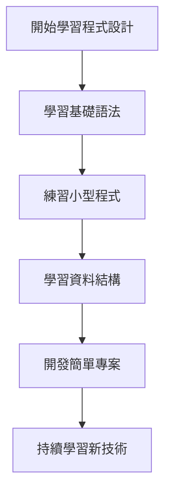

# A113222003 邱渝璇的履歷

## 關於我

> 我是邱渝璇，就讀世新大學資訊管理系大二，對**程式設計與資訊技術**很有興趣，  
> 目前正在學習多種程式語言與軟體開發技術，希望未來能進入**軟體或資訊相關產業**發展。

### 基本資料
我叫 **邱渝璇**，目前就讀 **世新大學資訊管理學系二年級**。  

我來自 **台北**，上大學後開始接觸程式設計，  
在學習 **Python、Java、C++、網頁技術** 的過程中，逐漸培養出對程式開發的興趣。

### 我的興趣
- 看電影 
- 聽音樂 


### 我的目標
1. 在大學期間建立扎實的 **程式設計基礎**
2. 學習 **軟體開發與系統設計能力**
3. 未來進入 **資訊科技或軟體開發相關產業**
4. 持續學習新的 **程式語言與技術**

---

## 我學過的程式課程

### 目前正在學習
1. 資料結構  
2. 物件導向程式設計  
3. 網頁程式設計  
4. 行動裝置程式設計  

### 未來想學
1. 資料庫系統  
2. 計算機網路  
3. 作業系統  
4. 軟體工程  

---

## 程式碼展示

以下是一個簡單的 **Python 範例程式**：

```python
def hello(name):
    print("Hello,", name)

hello("Shu Student")
```

| 程式語言 | 熟練度(1~5) | 學習年限 | 喜愛程度(1~5) |
| -------- | ----------- | -------- | ------------- |
| Python   | 2           | 2年      | 3             |
| Java     | 2           | 1年      | 3             |
| C++      | 2           | 2年      | 5             |
| HTML     | 2           | 1年      | 2             |
| CSS      | 1           | 1年      | 3             |


